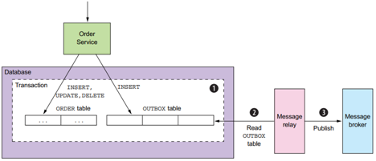

<<<<<<< HEAD
# Back End Template
- [Quy định về các convention trong project](#I.-Quy-định-về-các-convention-trong-project)
    - [Quy hoạch package trong project](#1-Quy-hoạch-package-trong-project)
    - [Cách đặt tên các đầu API theo chuẩn restful naming](#2-Cách-đặt-tên-các-đầu-API-theo-chuẩn-restful-naming)
    - [Cách comment commit](#3-Cách-comment-commit)
    - [Cách đặt tên nhánh](#4-Cách-đặt-tên-nhánh)
- [Hướng dẫn lập trình và sử dụng gen code và các hàm có sẵn](#II-Hướng-dẫn-lập-trình-và-sử-dụng-gen-code-và-các-hàm-có-sẵn)
    - [Import libs](#1-Import-libs)
    - [Thực hiện gen code](#2-Thực-hiện-gen-code)
    - [Các hàm common trong class Utils](#3-Các-hàm-common-trong-class-Utils)
    - [Khai báo mã lỗi và trả mã lỗi về cho client](#4-Khai-báo-mã-lỗi-và-trả-mã-lỗi-về-cho-client)
    - [Cấu hình các API bỏ qua xác thực (API public)](#5-Cấu-hình-các-API-bỏ-qua-xác-thực-(API-public))
    - [Thực hiện ký chứng thư số từ USB](#6-Thực-hiện-ký-chứng-thư-số-từ-USB)
        - [Khai các mã lỗi, hàm common và lib](#6.1-Bước-1:-Khai-các-mã-lỗi,-hàm-common-và-lib)
        - [Thực hiện lấy hash file và khai báo khởi tạo hệ chữ ký số](#6.2-Bước-2:-Thực-hiện-lấy-hash-file-và-khai-báo-khởi-tạo-hệ-chữ-ký-số)
        - [Thực hiện attach chữ ký số vào file PDF.](#6.3-Bước-3:-Thực-hiện-attach-chữ-ký-số-vào-file-PDF.)
    - [Hướng dẫn thực hiện cache trên spring service](#7-Hướng-dẫn-thực-hiện-cache-trên-spring-service)
    - [Hướng dẫn thực hiện outbox event](#8-Hướng-dẫn-thực-hiện-outbox-event)
- [Hướng dẫn tích hợp hệ thống ELK STACK](#3-hướng-dẫn-tích-hợp-hệ-thống-elk-stack)
## I. Quy định về các convention trong project
### 1 Quy hoạch package trong project
````
      Package vn.com.viettel.controlers:        Nơi chứa các class tầng giao tiếp với bên ngoài và handler các request từ bên ngoài tới hệ thống.
      Package vn.com.viettel.dto:               Nơi chứa các Class Data transfer object
      Package vn.com.viettel.services:          Nơi chứa các class xử lý nghiệp vụ
      Package vn.com.viettel.services.jpa:      Nơi chứa các class xử lý nghiệp vụ và sử dụng JPA của spring boot để xử lý
      Package vn.com.viettel.repositories:      Nơi chứa các class giao tiêp xử lý với database
      Package vn.com.viettel.repositories.jpa:  Nơi chứa các class giao tiêp xử lý với database và sử dụng JPA của spring boot để xử lý
      Package vn.com.viettel.entities:          Nơi chứa các class Java mapping với Table trong databases.
      Package vn.com.viettel.utils:             Nơi chứa các hàm common và contants dùng chung cho project
````
### 2 Cách đặt tên các đầu API theo chuẩn restful naming. Tham khảo thêm https://restfulapi.net/resource-naming/
````
      Ví dụ cụ thể viết api cho form quản lý KH
      1. Thêm mới một khách hàng
         Method POST
         Naming api : $HOST/api/v1/customers
=======
![[viettel-logo]][logo-vt-url]

# VTS KIT BACKEND BASE
- [Built-in Feature](#i-built-in-feature)
    - [Code Generation](#1-code-generatione)
    - [Common functions in class Utils](#2-common-functions-in-class-utils)
    - [Declare the error code and return the error code to the client](#3-declare-the-error-code-and-return-the-error-code-to-the-client)
    - [Configure authentication bypass APIs (public APIs)](#4-configure-authentication-bypass-apis-public-apis)
    - [Signing digital certificates from USB](#5-signing-digital-certificates-from-usb)
        - [Declare error codes, common functions, lib](#51-Declare-error-codes-common-functions-lib)
        - [Get the file hash and declare the initialization of the digital signature system](#52-get-the-file-hash-and-declare-the-initialization-of-the-digital-signature-system)
        - [Attach digital signature to PDF file](#53-attach-digital-signature-to-pdf-file)
    - [Instructions for implementing cache on spring service](#6-instructions-for-implementing-cache-on-spring-service)
    - [Instructions for implementing outbox events](#7-instructions-for-implementing-outbox-events)
- [ELK STACK system integration guide](#ii-elk-stack-system-integration-guide)
- [Addition feature]()
    - [Integration Maria DB](https://github.com/vts-contributor/vts-kit-ms-maria-data.git)
    - [Integration Mongo DB](https://github.com/vts-contributor/vts-kit-ms-mongo-data.git)
    - [Integration MinIO](https://github.com/vts-contributor/vts-kit-ms-minio-integrated.git)
    - [Integration Keycloak Auth](https://github.com/vts-contributor/vts-kit-ms-keycloak-auth.git)
    - [Integration Kafka](https://github.com/vts-contributor/vts-kit-ms-kafka-integrated.git)
    - [Integration Elasticsearch](https://github.com/vts-contributor/vts-kit-ms-elasticsearch-data.git)
    - [Integration Kong Ingress Controller](//https://github.com/vts-contributor/vts-kit-kong-ingress-controller.git)
    - [Redis Caching](https://github.com/vts-contributor/vts-kit-ms-redis-cache.git)
>>>>>>> 272e1cd7901e17c672ba6e97b513b50dec2db03b


## I. Built-in Feature


### 1. Code Generation
The file config.properties is used to configure the generate code \
Configure the database to generate code, change the corresponding database information for the application that is coding.
```properties
    spring.datasource.url=jdbc:oracle:thin:@10.60.157.9:1521:dbpt
    spring.datasource.username=app
    spring.datasource.password=app#123
```
Configure the generated code directory path
```properties
    src.url.create.code
```
Define class and methods to generate in file template.json
```
className: Name of the class you want to create
desc: Describe in detail information about the class you want to create, what business function the class performs
listMethod: List of Methods in the class to create
    "type":"post": Type of request method ("get", "post", "put", "delete"),
    "name": Definition method name,
    "value":"/customers/{customerId}/contracts": Information about API URI,
    "sql": Definition of SQL to get data (if any), the parameters to be passed are written in ":TEN_PARAM_1", these variables can be passed from the Client to get the data,
    "count": Set the value to 1 to return a list of data and count. If not set, the default only returns list data,
    "params": Declare the parameters passed in from the client,
    "jpa": Configure = true so that gen according to JPA will generate gen according to SQL Native command (Note that simple sql must use gen according to JPA)
```
Example
```json
{
   "className": "Employees",
   "desc": "Employee list manipulation class",
   "listMethod": [
       {
           "type": "get",
           "name": "getEmployees",
           "value": "/v1/employees",
           "sql": "SELECT * FROM HR_EM                                                                                                                                                                                                                  PLOYEES WHERE (:employeeId is null or EMPLOYEE_ID = :employeeId ) AND (:fullName is null or FULL_NAME LIKE %:fullName%)",
           "params":["employeeId","fullName"],
           "desc": "Get employee information",
           "count": 1,
           "jpa": true
       }
   ]
}
```
Execute generate code:
```
Run main function in file MainGenCode
```
### 2. Common functions in class Utils
The functions that will be shared are written in this class
````
- Check if the file is valid
    boolean isValid = Utils.checkFileValid(fileName, file, maxFileSizeMb);
````

### 3. Declare the error code and return the error code to the client
```java
vn.com.viettel.utils.ErrorApp : The class defines the error codes. Declare more error codes here
Returns an error code to the client using the ResponseUtils class with the method getResponseEntity(ErrorApp errorApp, HttpStatus HttpStatus)
```
### 4. Configure authentication bypass APIs (public APIs)
```properties
permission.ignore.url = /api/v1/public/config;/api/v1/public/config/**;
Where /api/v1/public/config and api prefixes /api/v1/public/config are API URIs that need to be public
```
### 5. Signing digital certificates from USB
#### 5.1: Declare error codes, common functions, lib
```java
    // Declare Constant in class vn.com.viettel.utils.Constants
    public interface SIGN_CODE {
        Integer SUCCESS = 1;        //Successful
        Integer CERT_EXPIRE = 2;    //Error cert expired
        Integer NOT_FOUND = 3;      //Error cert does not exist
    }
```
```java
    // Declare Common function in class vn.com.viettel.utils.Utils
    /**
     * Remove hours in date
     *
     * @param dateCv
     * @return
     */
    public static Date dateSort(Date dateCv) {
        Date date = null;
        String strDate = dateShow(dateCv, false);
        try {

            date = new SimpleDateFormat("dd/MM/yyyy").parse(strDate);
        } catch (ParseException ex) {
            LOGGER.error("==========datnv5: dateSort null", ex);
        }
        return date;
    }
```

```java
    
    /**
     * Check digital certificate
     * @param strCertificate
     * @return
     */
    public static Integer checkCer(String strCertificate) {
        Date now = new Date();
        now = dateSort(now);
        if (strCertificate != null && strCertificate.trim().length() > 0) {
            // Tao doi tuong ky mem
            X509Certificate x509Cert = CertUtils.getX509Cert(strCertificate);
            if (now.compareTo(dateSort(x509Cert.getNotAfter())) > 0
                    || now.compareTo(dateSort(x509Cert.getNotBefore())) < 0) {
                return Constants.SIGN_CODE.CERT_EXPIRE;
            } else {
                return Constants.SIGN_CODE.SUCCESS;
            }
        } else {
            return Constants.SIGN_CODE.NOT_FOUND;
        }
    }

```

```xml
    //Declare more lib in file pom.xml
    <dependency>
        <groupId>com.itextpdf</groupId>
        <artifactId>itextpdf</artifactId>
        <version>5.5.5</version>
    </dependency>
    <dependency>
        <groupId>com.viettel.digital</groupId>
        <artifactId>viettelsign</artifactId>
        <version>1.0-RELEASE</version>
    </dependency>

```

#### 5.2: Get the file hash and declare the initialization of the digital signature system
```java
    Integer statusCheckCert = Utils.checkCer("Cert Base String");
    if (statusCheckCert == 1) {
        SignerInfo signerInfo = new SignerInfo();
        signerInfo.setUserName("Test Sign");
        signerInfo.setUserId(1L);
        String strFilePdf = "Pdf File Path To Sign";
        String strFilePdfSigned = "Signed Pdf File Path";
        UsbSign usbSign = new UsbSign(signerInfo, strFilePdf, strFilePdfSigned, false);
        JSONObject jsonObj = new JSONObject();
        jsonObj.put("location", "ETC GROUP");
        String strLocation = jsonObj.toString();
        try {
            //Type the hash of the pdf file including 2 parts: number 1 is hash, number 2 is serial number
            List<String> listHashInfo = usbSign.getDigest("strCert", "", strLocation);
            //TODO: Save the softSign in the session ke
    
            String sessionId = "SessionId string retrieved from HttpServletRequest";
            HttpSession session = req.getSession(true);
            session.setAttribute("signObject", usbSign);
            // Put the session in the manager
            HttpSessionCollector.putSession(sessionId, session);
        } catch (Exception ex) {
            //"Hash file doesn't exist:"
            System.out.println("signFileExtentCa");
            System.out.println(ex);
        }
    } else {
        //Notify the client of the error code
    }
```
#### 5.3: Attach digital signature to PDF file
```java
    String sessionId = "SessionId string on save";
    HttpSession session = HttpSessionCollector.find(sessionId);
    SoftSign softSign = (SoftSign) session.getAttribute("signObject");
    try {
        softSign.appendSignature("String of digital signatures after signing");
    } catch (Exception ex) {
        //"Hash file doesn't exist"
        System.out.println("Append signature");
        System.out.println(ex);
    }
```
### 6. Instructions for implementing cache on spring service
   ```java
   public class CityService {
   
       @Autowired
       private CityRepository cityRepository;
   
       @Transactional
       @Cacheable(value = "city", key = "#id")
       public City findById(Long id) {
           City city;
           Optional<City> cityResponse = cityRepository.findById(id);
           if (cityResponse.isPresent()) {
               city = cityResponse.get();
           } else {
               throw new RuntimeException("Record not found");
           }
           return city;
       }
   
       @Transactional
       @CachePut(value = "city", key = "#city.id")
       public City save(City city) {
           City createResponse = cityRepository.save(city);
           return createResponse;
       }
   
       @Transactional
       @CacheEvict(value = "city", key = "#city.id")
       public void delete(City city) {
           cityRepository.delete(city);
       }
   }

    When findById is called, for example with parameter id = 1; First look in the cache for an object with the key city::1
          o If there is an object in redis, return the result and do not need to query the database
          o If there is no object in redis, query the database to get the object. When it is obtained, reset the object into the cache with the key also being city::1
    When save(city) is called, in addition to saving it to the db, it also saves the redis object under the key city::{object_id}
    When delete(city) is called, in addition to deleting in db, also call delete command city::{object_id} in redis
```

### 7. Instructions for implementing outbox events



#### 7.1 Each service, which comes with its own database (database per service pattern), needs to create an OUTBOX_EVENT table:
   ```sql
   CREATE TABLE IF NOT EXISTS outbox_event
    (
        id             BINARY(16) PRIMARY KEY,           -- The id of the event, which can be used by consumers to detect duplicate events
        timestamp      BIGINT (15) UNSIGNED NOT NULL,    -- Event generation time, unix time by ms
        clazz          VARCHAR(255) NOT NULL,            -- Allow java backend to use deserializable json event in kafka to java class
        type           VARCHAR(255) NOT NULL,            -- Type of event, for example ORDER_CREATED
        aggregate_type VARCHAR(255) NOT NULL,            -- The type of the aggregate root to which a given event is related. For example, ORDER_CREATED then agg_type is Order. This field is used to route the event to the corresponding topic on kafka. So there will be 1 topic for all order related events, 1 topic for customer-related events.
        aggregate_id   VARCHAR(255) NOT NULL,            -- The id of the aggregate root, used to inject events into the kafka partition (if the topic setup has multiple partitions)
        payload        LONGTEXT NOT NULL                 -- Event contents (JSON structure)
    );
   ```

All outbox events should inherit from the following class
   ```java
   @JsonIgnoreProperties(ignoreUnknown = true)
   @JsonTypeInfo(use = JsonTypeInfo.Id.MINIMAL_CLASS, property = "clazz")
   public class ExportedEvent<T> implements Serializable {
   
       UUID id;
       String type;
       String aggregateType = getGenericName(); // getSimpleName of T
       String aggregateId;
       T payload;
       long timestamp;
   }
   ```
For example, an event would look like this:
   ```java
   public class CityCreatedEvent extends ExportedEvent<City> {
       private static final String TYPE = "CITY_CREATED";
   
       public CityCreatedEvent() {
           this.type = TYPE;
       }
   
       private CityCreatedEvent(City city) {
           this();
           this.payload = city;
           this.aggregateId = city.getId().toString();
       }
   
       public static CityCreatedEvent of(City city) {
           return new CityCreatedEvent(city);
       }
   }
   ```

#### 7.2 Producer event
   ```java
   @Autowired
   OutboxEventSender event;
   
   @Transactional
   public City save(City city) {
       City createResponse = cityRepository.save(city);
   
       event.fire(CityCreatedEvent.of(createResponse));
       event.fire(CityUpdatedEvent.of(createResponse));
   
       return createResponse;
   }
   ```
The save function (database insert) and 2 events are newly added to the database in the same transaction.\
Example of data newly added to the OUTBOX_EVENT table:


#### 7.3 Event in Apache Kafka
With aggregate_type = City, on Kafka there will be a corresponding topic: outbox.event.City
As mentioned above aggregate_id is used to inject bulletins into the topic partition if the topic is set up with more than 1 partition.
Message payload in a message in topic outbox.event.City
   ```json
   {
       "payload":"{\"id\":50,\"name\":\"HaNoi\",\"population\":0}",
       "id":"8894c9445b3f4c76879014cdb8fe120b",
       "timestamp":1621252605228,
       "clazz":".CityUpdatedEvent",
       "aggregateId":"50"
   }
   ```

#### 7.4 Receive and handle events
Register to receive events on the topic outbox.event.City,
When receiving event, receiver will pass ApplicationEventPublisher to publishEvent, handlers will receive and handle this event.
   ```java
   @EnableBinding(CityOutboxEventReceiver.Processor.class)
   public class CityOutboxEventReceiver {
   
       @Autowired
       private ApplicationEventPublisher publisher;
       private static final Logger LOG = LoggerFactory.getLogger(CityOutboxEventReceiver.class);
   
       @StreamListener(Processor.INPUT)
       public void process(KafkaOutboxEvent<City> event) {
           LOG.info("Time delta: " + String.valueOf(System.currentTimeMillis() - event.getPayload().getTimestamp()));
           publisher.publishEvent(event.getPayload());
       }
   
       interface Processor {
           String INPUT = "CityOutboxEvent";
   
           @Input(INPUT)
           SubscribableChannel input();
       }
   }
   ```
<<<<<<< HEAD
## 3. Hướng dẫn tích hợp hệ thống ELK STACK
### Cài đặt agent cho ứng dụng java, tomcat chạy trên K8s
Đối với hệ thống chạy k8s: Cần rebuild lại image.\
- Bước 1: Copy file elastic-apm-agent-1.29.0.jar vào folder apm-agent ở project 
          để buil lại image. Có thể download tại: [Elastic-apm-agent-1.29.0](#http://10.254.144.164:8081/repository/maven-public/com/atviettelsolutions/vts-kit-elastic-apm-agent/1.29.0/vts-kit-elastic-apm-agent-1.29.0.jar)
- Bước 2: Thêm command sau vào Dockerfile: COPY ./apm-agent /apm-
- Bước 3: Sửa image mới và thêm biến môi trường trong k8s deployment
=======
[logo-vt-url]: docs/image/logo-vt.svg

## II. ELK STACK system integration guide
### Install agent for java application, tomcat running on K8s
For systems running k8s: Need to rebuild image.
- Step 1: Copy the file elastic-apm-agent-1.29.0.jar to the apm-agent folder in the project to rebuild the image. Downloadable at: [Elastic-apm-agent-1.29.0](#http://10.254.144.164:8081/repository/maven-public/com/atviettelsolutions/vts-kit-elastic-apm-agent/1.29.0/vts-kit-elastic-apm-agent-1.29.0.jar)
- Step 2: Add the following command to the Dockerfile: COPY ./apm-agent /apm-agent
- Step 3: Edit new image and add environment variable in k8s deployment

>>>>>>> 272e1cd7901e17c672ba6e97b513b50dec2db03b
```yaml
- name: _JAVA_OPTIONS
  value: -Xmx5g -XX:+UseG1GC -Delastic.apm.service_name=<service_name> -
Delastic.apm.server_urls=http://10.254.145.240:8086/apm-server -javaagent:/apm-agent/elastic-apm-agent-1.29.0.jar
```
<<<<<<< HEAD
Lưu ý: Tham số -Xmx5g -XX:+UseG1GC cấu hình tùy thuộc vào tài nguyên sẵn 
có
- Bước 4: Restart lại ứng dụng.
- Bước 5: Kiểm tra sau khi cài đặt.
    - Chạy lệnh ""ps -ef | grep tomcat"" (Kiểm tra xem tiến trình tomcat vừa tác 
động đã có tiến trình apm chưa).
    - Truy cập dashboard ELK xem hệ thống đã được add lên chưa.
    - Kiểm tra nghiệp vụ ứng dụng xem có lỗi không
=======

Note: The -Xmx5g -XX:+UseG1GC parameter is configurable depending on resource availability.

- Step 4: Restart the application.
- Step 5: Check after installation.
    - Run the command ""ps -ef | grep tomcat"" (Check if the active tomcat process already has apm process).
    - Access the ELK dashboard to see if the system has been added.
    - Check the application business for errors


>>>>>>> 272e1cd7901e17c672ba6e97b513b50dec2db03b
