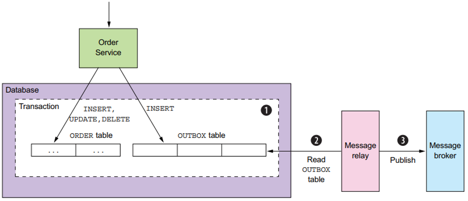

<p align="center">
    
</p>
    
# Back End Template
- [Quy định về các convention trong project](#I.-Quy-định-về-các-convention-trong-project)
    - [Quy hoạch package trong project](#1-Quy-hoạch-package-trong-project)
    - [Cách đặt tên các đầu API theo chuẩn restful naming](#2-Cách-đặt-tên-các-đầu-API-theo-chuẩn-restful-naming)
    - [Cách comment commit](#3-Cách-comment-commit)
    - [Cách đặt tên nhánh](#4-Cách-đặt-tên-nhánh)
- [Hướng dẫn lập trình và sử dụng gen code và các hàm có sẵn](#II.-Hướng-dẫn-lập-trình-và-sử-dụng-gen-code-và-các-hàm-có-sẵn)
    - [Import libs](#1.-Import-libs)
    - [Thực hiện gen code](#2.-Thực-hiện-gen-code)
    - [Các hàm common trong class Utils](#3.-Các-hàm-common-trong-class-Utils)
    - [Khai báo mã lỗi và trả mã lỗi về cho client](#4.-Khai-báo-mã-lỗi-và-trả-mã-lỗi-về-cho-client)
    - [Cấu hình các API bỏ qua xác thực (API public)](#5.-Cấu-hình-các-API-bỏ-qua-xác-thực-(API-public))
    - [Thực hiện ký chứng thư số từ USB](#6.-Thực-hiện-ký-chứng-thư-số-từ-USB)
        - [Khai các mã lỗi, hàm common và lib](#6.1-Bước-1:-Khai-các-mã-lỗi,-hàm-common-và-lib)
        - [Thực hiện lấy hash file và khai báo khởi tạo hệ chữ ký số](#6.2-Bước-2:-Thực-hiện-lấy-hash-file-và-khai-báo-khởi-tạo-hệ-chữ-ký-số)
        - [Thực hiện attach chữ ký số vào file PDF.](#6.3-Bước-3:-Thực-hiện-attach-chữ-ký-số-vào-file-PDF.)
    - [Hướng dẫn thực hiện cache trên spring service](#7.-Hướng-dẫn-thực-hiện-cache-trên-spring-service)
    - [Hướng dẫn thực hiện outbox event](#8.-Hướng-dẫn-thực-hiện-outbox-event)

## I. Quy định về các convention trong project
### 1 Quy hoạch package trong project
````
      Package vn.com.viettel.controlers:        Nơi chứa các class tầng giao tiếp với bên ngoài và handler các request từ bên ngoài tới hệ thống.
      Package vn.com.viettel.dto:               Nơi chứa các Class Data transfer object
      Package vn.com.viettel.services:          Nơi chứa các class xử lý nghiệp vụ
      Package vn.com.viettel.services.jpa:      Nơi chứa các class xử lý nghiệp vụ và sử dụng JPA của spring boot để xử lý
      Package vn.com.viettel.repositories:      Nơi chứa các class giao tiêp xử lý với database
      Package vn.com.viettel.repositories.jpa:  Nơi chứa các class giao tiêp xử lý với database và sử dụng JPA của spring boot để xử lý
      Package vn.com.viettel.entities:          Nơi chứa các class Java mapping với Table trong databases.
      Package vn.com.viettel.utils:             Nơi chứa các hàm common và contants dùng chung cho project
````
### 2 Cách đặt tên các đầu API theo chuẩn restful naming. Tham khảo thêm https://restfulapi.net/resource-naming/
````
      Ví dụ cụ thể viết api cho form quản lý KH
      1. Thêm mới một khách hàng
         Method POST
         Naming api : $HOST/api/v1/customers

      2. Tìm kiếm thông tin khách hàng
         Method GET
         Naming api : $HOST/api/v1/customers
      
      3. Lấy thông tin chi tiết một khách hàng theo customerId trong đó customerId là ID của KH trong bảng Customer
         Method GET
         Naming api: $HOST/api/v1/customers/{customerId}
      
      4. Cập nhật thông tin cho một khách hàng theo customerId
         Method PUT
         Naming api: $HOST/api/v1/customers/{customerId}
      
      5. Xóa thông tin một khách hàng theo customerId
         Method DELETE
         Naming api: $HOST/api/v1/customers/{customerId}
````
### 3 Cách comment commit theo https://www.conventionalcommits.org/en/v1.0.0/
````
      Mục đích: sau khi xóa nhánh phát triển, fix lỗi logs vẫn còn, và có thể thực hiện các chức năng mở rộng theo định đang đầu logs, ngoài ra còn hỗ trợ tìm kiếm nhanh.
      Cấu trúc:
      <type>[scope]: <description>
      [optional body]
      -	type: Sử dụng các từ khóa sau để mô tả nội dung làm.
           feat: thêm một feature
           fix: fix bug cho hệ thống, vá lỗi trong codebase
           refactor: sửa code nhưng không fix bug cũng không thêm feature hoặc đôi khi bug cũng được fix từ việc refactor.
           docs: thêm/thay đổi document
           chore: những sửa đổi nhỏ nhặt không liên quan tới code
           style: những thay đổi không làm thay đổi ý nghĩa của code như thay đổi css/ui chẳng hạn.
           perf: code cải tiến về mặt hiệu năng xử lý
           vendor: cập nhật version cho các dependencies, packages.
      -	description: là mô tả ngắn về những gì sẽ bị sửa đổi trong commit đấy
      -	body: là mô tả dài và chi tiết hơn, cần thiết khi description chưa thể nói rõ hết được, có thể thêm phần ghi chú bằng các keyword
````
### 4 Cách đặt tên nhánh
````
      3.1 Nhánh master: nhánh chính chứa source code ổn định, đã được kiểm tra và có thể triển khai lên production. 
      Các kiểm tra cuối cùng sẽ được kiểm thử trên nhánh master phục vụ tích hợp trước triển khai.

      3.2 Nhánh develop: nhánh chính chứa source code mới nhất. Nhánh phục vụ quá trình phát triển của developer. 
      Tất cả các thay đổi mới nhất sẽ được push/merge lên nhánh develop phục vụ quá trình phát triển liên tục tích hợp CI/CD
      
      3.3 Feature branches: các nhánh hỗ trợ phục vụ quá trình phát triển
         Checkout từ: develop
         Merge vào: develop
         Đặt  tên:  [feature]/[Email  Nhân viên  phát  triển]-[Chức năng phát triển] 
         Ví dụ: feature/[duybvk]-manage-employees
         Lưu ý: Tên feature không sử dụng tiếng việt và không chứa dấu cách dấu cách
      Khi phát triển một tính năng mới, một nhánh feature sẽ được tạo từ source code mới nhất của nhánh develop, nhằm tách biệt với các tính năng đang phát triển khác. 
      Sau đó được merge vào nhánh develop khi đã sẵn sàng để test phục vụ tích hợp CI/CD trên môi trường phát triển
      
      3.4 Hotfix branches:
         Checkout từ: master
         Merge vào: develop và master
         Đặt tên: hotfix/[chức năng hotfix] ví dụ: hotfix/opt-error
      Khi có một bug nghiêm trọng trên bản production cần được giải quyết ngay lập tức, một hotfix branch sẽ được tách ra từ master
      Sau đó merge vào lại cả master và develop để ngăn lỗi xảy ra ở những lần release sau.
````
## II. Hướng dẫn lập trình và sử dụng gen code và các hàm có sẵn

### 1. Import libs
Thực hiện copy thư mục "vn" ở trong thư mục Libs vào MAVEN\Repository

Hoặc cài lib local qua lênh sau. Bật command line tại thư mục Libs và copy lệnh sau:
````
mvn install:install-file -Dfile=vts-kit-backend-core-jpa-1.0-RELEASE.jar -DgroupId=vn.com.viettel.core -DartifactId=vts-kit-backend-core-jpa -Dversion=1.0-RELEASE -Dpackaging=jar
````

Nếu sử dụng keycloak để xác thực thì cài lib
````
mvn install:install-file -Dfile=vts-kit-backend-core-keycloak-1.0-RELEASE.jar -DgroupId=vn.com.viettel.core -DartifactId=vts-kit-backend-core-keycloak -Dversion=1.0-RELEASE -Dpackaging=jar
````

Nếu không sử dụng keycloak để xác thực thì cài lib
````
mvn install:install-file -Dfile=vts-kit-backend-core-1.0-RELEASE.jar -DgroupId=vn.com.viettel.core -DartifactId=vts-kit-backend-core -Dversion=1.0-RELEASE -Dpackaging=jar
````

### 2. Thực hiện gen code
File config.properties dùng để cấu hình gen code
Cấu hình database để gen code, thay đổi thông tin database tương ứng cho ứng dụng đang code
   ```
   spring.datasource.url=jdbc:oracle:thin:@10.60.157.9:1521:dbpt
   spring.datasource.username=app
   spring.datasource.password=app#123
   ```
Cấu hình đường dẫn thư mục code được gen ra
   ```
   src.url.create.code
   ```

    Định nghĩa class và các phương thức cần gen trong file template.json
    Trong đó:
        className: Là tên của class muốn tạo 
        desc: Mô tả chi tiết thông tin về class muốn tạo, class thực hiện cho chức năng nghiệp vụ gì
        listMethod: Danh sách Method trong class cần tạo
            "type":"post": Loại request method ("get", "post", "put", "delete")
            "name": Tên phương thức định nghĩa
            "value":"/customers/{customerId}/contracts": Thông tin về URI API
            "sql": Định nghĩa SQL lấy dữ liệu (nếu có), các tham số cần truyền vào viết theo ":TEN_PARAM_1", các biến này có thể truyền từ Client để lấy dữ liệu
            "count": Set giá trị là 1 để trả về list data and count. Nếu không set mặc định chỉ trả về list data
            "params": Khai báo các tham số truyền vào từ client,
            "jpa": Cấu hình = true để gen theo JPA ngược lại sẽ gen theo lệnh SQL Native ( Chú ý các sql đơn giản phải sử dụng gen theo JPA )
    Ví dụ
   ```
   {
       "className": "Employees",
       "desc": "Lớp thao tác danh sach nhan vien",
       "listMethod": [
           {
               "type": "get",
               "name": "getEmployees",
               "value": "/v1/employees",
               "sql": "SELECT * FROM HR_EMPLOYEES WHERE (:employeeId is null or EMPLOYEE_ID = :employeeId ) AND (:fullName is null or FULL_NAME LIKE %:fullName%)",
               "params":["employeeId","fullName"],
               "desc": "Lấy thông tin nhân viên",
               "count": 1,
               "jpa": true
           }
       ]
   }
   ```

    Thực hiện gen code: chạy hàm main trong file MainGenCode

### 3. Các hàm common trong class Utils: các hàm dùng chung được viết tại class này
````
    - Kiểm tra file xem có hợp lệ không
        boolean isValid = Utils.checkFileValid(fileName, file, maxFileSizeMb);
````

### 4. Khai báo mã lỗi và trả mã lỗi về cho client
````
    vn.com.viettel.utils.ErrorApp : Class định nghĩa các mã lỗi. Khai báo thêm mã lỗi ở đây
    Trả về mã lỗi cho client sử dụng class ResponseUtils với method getResponseEntity(ErrorApp errorApp, HttpStatus httpStatus)
````
### 5. Cấu hình các API bỏ qua xác thực (API public)
````
    permission.ignore.url = /api/v1/public/config;/api/v1/public/config/**;
    Trong đó /api/v1/public/config và các api có prefix /api/v1/public/config là các URI API cần được public
````
### 6.Thực hiện ký chứng thư số từ USB gồm 3 bước
#### 6.1 Bước 1: Khai các mã lỗi, hàm common và lib
`````
    - Khai báo Constants trong class vn.com.viettel.utils.Constants
    public interface SIGN_CODE {
        Integer SUCCESS = 1;        //Thành công
        Integer CERT_EXPIRE = 2;    //Lỗi cert hết hạn
        Integer NOT_FOUND = 3;      //Lỗi cert không tồn tại
    }

    - Khai báo hàm Common trong class vn.com.viettel.utils.Utils
        /**
         * loai bo gio trong date
         *
         * @param dateCv
         * @return
         */
        public static Date dateSort(Date dateCv) {
            Date date = null;
            String strDate = dateShow(dateCv, false);
            try {
    
                date = new SimpleDateFormat("dd/MM/yyyy").parse(strDate);
            } catch (ParseException ex) {
                LOGGER.error("==========datnv5: dateSort null", ex);
            }
            return date;
        }
    
        /**
         * kiem tra chung thu so
         * @param strCertificate
         * @return
         */
        public static Integer checkCer(String strCertificate) {
            Date now = new Date();
            now = dateSort(now);
            if (strCertificate != null && strCertificate.trim().length() > 0) {
                // Tao doi tuong ky mem
                X509Certificate x509Cert = CertUtils.getX509Cert(strCertificate);
                if (now.compareTo(dateSort(x509Cert.getNotAfter())) > 0
                        || now.compareTo(dateSort(x509Cert.getNotBefore())) < 0) {
                    return Constants.SIGN_CODE.CERT_EXPIRE;
                } else {
                    return Constants.SIGN_CODE.SUCCESS;
                }
            } else {
                return Constants.SIGN_CODE.NOT_FOUND;
            }
        }
    - Khai báo thêm lib trong file pom.xml
    <dependency>
        <groupId>com.itextpdf</groupId>
        <artifactId>itextpdf</artifactId>
        <version>5.5.5</version>
    </dependency>
    <dependency>
        <groupId>com.viettel.digital</groupId>
        <artifactId>viettelsign</artifactId>
        <version>1.0-RELEASE</version>
    </dependency>
`````
#### 6.2 Bước 2: Thực hiện lấy hash file và khai báo khởi tạo hệ chữ ký số. Xem code mẫu dưới
````
    Integer statusCheckCert = Utils.checkCer("chuoi base cert");
    if (statusCheckCert == 1) {
        SignerInfo signerInfo = new SignerInfo();
        signerInfo.setUserName("Test Sign");
        signerInfo.setUserId(1L);
        String strFilePdf = "duong dan file pdf can ky";
        String strFilePdfSigned = "duong dan file pdf da ky";
        UsbSign usbSign = new UsbSign(signerInfo, strFilePdf, strFilePdfSigned, false);
        JSONObject jsonObj = new JSONObject();
        jsonObj.put("location", "ETC GROUP");
        String strLocation = jsonObj.toString();
        try {
            //danh chuoi hash cua file pdf gom  2 phan tu: so 1 la hash, so 2 la serial number
            List<String> listHashInfo = usbSign.getDigest("strCert", "", strLocation);
            //TODO: thuc hien luu lai softSign vao session key
    
            String sessionId = "Chuoi sessionid lay tu HttpServletRequest";
            HttpSession session = req.getSession(true);
            session.setAttribute("signObject", usbSign);
            // Dat session vao bo quan ly
            HttpSessionCollector.putSession(sessionId, session);
        } catch (Exception ex) {
            //"Khong co hash file:"
            System.out.println("signFileExtentCa");
            System.out.println(ex);
        }
    } else {
        //thong bao ma loi cho client
    }
````
#### 6.3 Bước 3: Thực hiện attach chữ ký số vào file PDF. Xem code mẫu dưới
````
    String sessionId = "Chuoi sessionId luc luu lai";
    HttpSession session = HttpSessionCollector.find(sessionId);
    SoftSign softSign = (SoftSign) session.getAttribute("signObject");
    try {
        softSign.appendSignature("Chuoi chu ky so sau khu thuc hien ky");
    } catch (Exception ex) {
        //"Khong co hash file:"
        System.out.println("Append signature");
        System.out.println(ex);
    }
````
### 7. Hướng dẫn thực hiện cache trên spring service
   ```
   public class CityService {
   
       @Autowired
       private CityRepository cityRepository;
   
       @Transactional
       @Cacheable(value = "city", key = "#id")
       public City findById(Long id) {
           City city;
           Optional<City> cityResponse = cityRepository.findById(id);
           if (cityResponse.isPresent()) {
               city = cityResponse.get();
           } else {
               throw new RuntimeException("Record not found");
           }
           return city;
       }
   
       @Transactional
       @CachePut(value = "city", key = "#city.id")
       public City save(City city) {
           City createResponse = cityRepository.save(city);
           return createResponse;
       }
   
       @Transactional
       @CacheEvict(value = "city", key = "#city.id")
       public void delete(City city) {
           cityRepository.delete(city);
       }
   }
   ```
    Khi findById được gọi, ví dụ với tham số id = 1; Trước tiên tìm trong cache có object với key là city::1
     o	Nếu có object trong redis, trả kết quả và không cần truy vấn database
     o	Nếu không có object trong redis, truy vấn database lấy object. Khi lấy được, set lại object vào cache với key cũng là city::1
    Khi save(city) được gọi, ngoài việc lưu xuống db, cũng đồng thời lưu vào redis object đó theo key là city::{object_id}
    Khi delete(city) được gọi, ngoài việc xóa ở db, cũng đồng thời gọi lệnh xóa city::{object_id} ở redis.

### 8. Hướng dẫn thực hiện outbox event



#### 8.1 Mỗi service, đi kèm một database của chính nó (database per service pattern), cần tạo một bảng OUTBOX_EVENT:
   ```
   CREATE TABLE IF NOT EXISTS outbox_event
    (
        id             BINARY(16) PRIMARY KEY,           -- Id của event, có thể được sử dụng bởi consumer để detect duplicate event
        timestamp      BIGINT (15) UNSIGNED NOT NULL,    -- Thời gian phát sinh của event, unixtime by ms
        clazz          VARCHAR(255) NOT NULL,            -- Cho phép java backend sử dụng để Deserializable json event trong kafka thành java class
        type           VARCHAR(255) NOT NULL,            -- Type of event,ví dụ ORDER_CREATED
        aggregate_type VARCHAR(255) NOT NULL,            -- The type of the aggregate root to which a given event is related. Ví dụ, ORDER_CREATED thì agg_type là Order. Trường này được sử dụng để route event tới topic tương ứng trên kafka. Vì vậy sẽ có 1 topic cho tất cả các event liên quan tới order, 1 topic cho customer-related events.
        aggregate_id   VARCHAR(255) NOT NULL,            -- The id of the aggregate root, được sử dụng để đưa event vào kafka partition  (nếu setup topic có nhiều partition)
        payload        LONGTEXT NOT NULL                 -- Event contents (JSON structure)
    );
   ```

Tất cả các outbox event nên kế thừa từ class sau
   ```
   @JsonIgnoreProperties(ignoreUnknown = true)
   @JsonTypeInfo(use = JsonTypeInfo.Id.MINIMAL_CLASS, property = "clazz")
   public class ExportedEvent<T> implements Serializable {
   
       UUID id;
       String type;
       String aggregateType = getGenericName(); // getSimpleName of T
       String aggregateId;
       T payload;
       long timestamp;
   }
   ```
Ví dụ một event sẽ như sau
   ```
   public class CityCreatedEvent extends ExportedEvent<City> {
       private static final String TYPE = "CITY_CREATED";
   
       public CityCreatedEvent() {
           this.type = TYPE;
       }
   
       private CityCreatedEvent(City city) {
           this();
           this.payload = city;
           this.aggregateId = city.getId().toString();
       }
   
       public static CityCreatedEvent of(City city) {
           return new CityCreatedEvent(city);
       }
   }
   ```

#### 8.2 Producer event
   ```
   @Autowired
   OutboxEventSender event;
   
   @Transactional
   public City save(City city) {
       City createResponse = cityRepository.save(city);
   
       event.fire(CityCreatedEvent.of(createResponse));
       event.fire(CityUpdatedEvent.of(createResponse));
   
       return createResponse;
   }
   ```
    Hàm save (database insert) và 2 event được thêm mới vào database cùng trong một transaction.
    Ví dụ về dữ liệu được thêm mới vào bảng OUTBOX_EVENT:


#### 8.3 Event in Apache Kafka
Với aggregate_type = City, trên Kafka sẽ có tương ứng một topic: outbox.event.City
Như đã nói ở trên aggregate_id được dùng để đưa bản tin vào topic partition nếu topic được được setup có nhiều hơn 1 partition.
Message payload trong một message ở topic outbox.event.City
   ```
   {
       "payload":"{\"id\":50,\"name\":\"HaNoi\",\"population\":0}",
       "id":"8894c9445b3f4c76879014cdb8fe120b",
       "timestamp":1621252605228,
       "clazz":".CityUpdatedEvent",
       "aggregateId":"50"
   }
   ```

#### 8.4 Nhận và xử lý event
Đăng ký nhận event trên topic outbox.event.City,
Khi nhận được event, receiver sẽ thông qua ApplicationEventPublisher để publishEvent, các handler sẽ nhận và xử lý event này
   ```
   @EnableBinding(CityOutboxEventReceiver.Processor.class)
   public class CityOutboxEventReceiver {
   
       @Autowired
       private ApplicationEventPublisher publisher;
       private static final Logger LOG = LoggerFactory.getLogger(CityOutboxEventReceiver.class);
   
       @StreamListener(Processor.INPUT)
       public void process(KafkaOutboxEvent<City> event) {
           LOG.info("Time delta: " + String.valueOf(System.currentTimeMillis() - event.getPayload().getTimestamp()));
           publisher.publishEvent(event.getPayload());
       }
   
       interface Processor {
           String INPUT = "CityOutboxEvent";
   
           @Input(INPUT)
           SubscribableChannel input();
       }
   }
   ```
[logo-vt-url]: docs/image/logo-vt.svg
